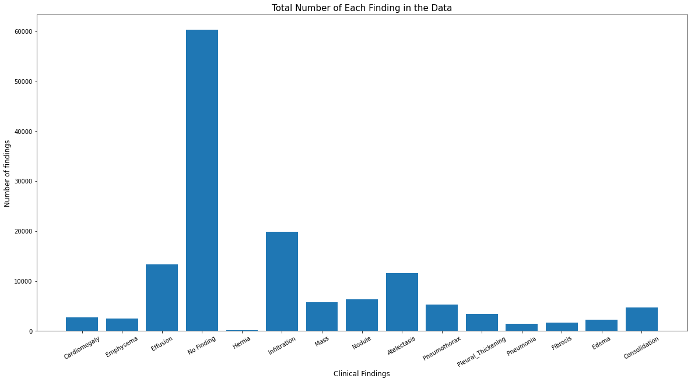

# Classifiying Positive Findings in Chest X Rays Using Convolutional Neural Networks
#### Author: John Lawless

Included in this repository:
- A Notebooks directory that contains the scripts used to create my models: Fully Trained vs Transfer Models, as well as models that were built for binary classification vs multilabel classification
- The csv downloaded from the NIH source
- The images used in this readme file and the presentation slides
- My current best performing model saved as a zip file. The notebooks directory also has a short script that instructs on how to load in the saved model, format new images, and make predictions from it

*Note that the full image library is not inlcuded in this repo, due to size limitations, but this data can be found from the [source at NIH](https://nihcc.app.box.com/v/ChestXray-NIHCC)*

## Table of Contents:
1. [Problem Statement](#probstat)
2. [Executive Summary](#summary)
    * [Dataset Information](#dinfo)
    * [Analysis of Finding Labels](#findings)
    * [Image File Information](#images)
    * [Clinical Background Information](#background) 
    * [Caveats and Limitations](#caveats)
3. [Methods](#method)
    * [Preparation of Data](#prep)
    * [Binary vs Multilabel Models](#bin_mult)
    * [Transfer Learning](#transfer)
    * [Fully Trained Modeling](#fulltrain)
4. [Next Steps](#next)
5. [Conclusion](#conclusion)
6. [References](#ref)

## Introduction

This project utilizes convolutional neural networks to study their capacity to interpret x ray images, classifying them according to various clinical findings. Included in this repo are the scripts that I used to model on this data, as well as saved versions of my (to date) best performing trained models, ready to be imported for the purpose of predicting new x ray images when acquired.


## Problem Statement <a name="probstat"></a>
---

[Medical imaging](https://en.wikipedia.org/wiki/Medical_imaging) is a clinical technique, utilizing high energy waves called elecromagnetic radiation to visualize the inside of the human body. This allows physicians to diagnose clinical signs and symptoms with their patients that may not otherwise be accessible to them by other methods, save for high risk techniques such as exploratory surgery. Ever since [William Röntgen](https://en.wikipedia.org/wiki/Wilhelm_Röntgen) first discovered that high frequency electromagnetic radiation (which he coined as the "X ray") in 1895, medical imaging has steadily grown in use in clinical settings around the world. From the two dimensional x ray, more complex forms of diagnostic medical imaging have also emerged, including CAT scans, using slices to image a patient in 3 dimensions, flouroscopy, which rapidly acquires images that can be viewed as a video for the purposes of visualizing motion, and Magnetic Resonance Imaging (MRI), the use of high frequency radio waves to image patients without the necessity of ionizing radiation.

As technology continues to advance, allowing for higher quality image acquisition, increased radiation safety, and the affordability of imaging equipment, the number of radiographic images (x rays) and other forms of medical images are rapidly increasing in daily use for diagnostic purposes. While this has led to many health benefits, it carries difficulties along with it, as well. [As multiple](https://www.ncbi.nlm.nih.gov/pmc/articles/PMC7006215/) different [sources](https://www.forbes.com/sites/brucejapsen/2020/06/26/us-doctor-shortage-could-hit-139000-by-2033/?sh=26055c116815) will [attest to](https://www.csahq.org/docs/default-source/news-and-events-docs/csa-bulletin-docs/volume-61-number-3/aug_2012_15_sibert_feature_61_3.pdf?sfvrsn=76f6c646_2), the United States in particular is facing a growing problem of a shortage of physicians, as newly trained physicians are not advancing in number fast enough to meet the rapidly increasing demands. In the medical imaging field in particular, this leads to those physicians trained to interpret these images, known as radiologists, being increasingly burdened with a heavier workload, which can lead to an increase in misdiagnoses as the sheer number of images they are expected to interpret grows beyond their capacity to safely diagnose and interpret them. 

The purpose of this project is to study the potential of utilizing machine learning algorithms in medical imaging clinical settings. Specifically, this project aims to analyze the effectiveness of classifying x ray images into their respective diagnoses, based on the features of the images themselves. If such an algorithm can achieve sufficiently high accuracy in predicting likely positive findings in patients, it can be deployed as a powerful radiology assistant tool in hospitals, potentially flagging high risk patients. This can help radiologists reduce the potential of missing diagnoses that require timely treatment for patient safety, acting as a "safety net" to encourage a second look at images that may be difficult to diagnose. It can also flag images that should be read sooner rather than later, if an algorithm indicates that they likely demonstrate critical findings. 

It should be stated at the outset that in no way should such a project be interpreted as intending to supplant or replace radiologists in their work. There is no replacement for the trained eyes of a radiologist. For ethical reasons, the safety and health of patients should not be entrusted completely to an algorithm, however accurate it may be. For another, no radiologist considers an x ray in a vacuum. There are vital elements, such as the patient's medical history, risk factors, or the information of an ordering physician, that such an algorithm would not have access to, but that a radiologist brings to bear on every interpretation they make. Having said this, the radiologist's experience and expertise, combined with the potential of modern deep learning applications, could greatly increase the health and well being of all patients, particularly the most vulnerable, in need of timely care. 

*Interestingly, as of the time that I began this project, [this article](https://www.fiercebiotech.com/medtech/bayer-signs-ai-imaging-platform-pact-blackford-analysis) was released, showing applications of professional attempts to build these algorithms already underway in the medical community.*

## Executive Summary <a name="summary"></a>
---
Utilizing multiple convolutional neural netoworks involving transfer learning and models fully trained from scratch on this data, the following can be reported on:
 - a pre-trained DenseNet model performed at baseline accuracy in classifying images according to all 15 possible labels
 - attempting to train a similar model from random weights has yet to produce accuracy equal or above baseline accuracy of about 58%
 - a pre-trained DenseNet model for binary classification of "No Finding" vs "Positive Finding" has consistently performed at around 67% accuracy on test data, which is about 10% above the baseline accuracy
 - training this same model from scratch has, to this point, consistently demonstrated close to 70% accuracy on unseen data

For more information as to these findings, the following information, especially the caveats section, will be helpful to understand the limitations of this study that are most likely to have contributed to these scores. 

---

**Dataset info** <a name="dinfo"></a>

The data for this project was collected from the [NIH Clinical Center](https://www.nih.gov/news-events/news-releases/nih-clinical-center-provides-one-largest-publicly-available-chest-x-ray-datasets-scientific-community), with images made publicly available via [Box](https://nihcc.app.box.com/v/ChestXray-NIHCC). The Box link also contains a csv file containing non identifier patient information, such as their age and gender, and the position of the patient when the radiograph was acquired. Also included in this dataset are labels identifying the findings reported by the radiologist reading the image. Importantly, these findings were NOT reported directly by the radiologist, but were extracted from the reports via a text mining method. From the [NIH README file](https://nihcc.app.box.com/v/ChestXray-NIHCC/file/220660789610) on this data: *"Note that original radiology reports (associated with these chest x-ray studies) are not meant to be publicly shared for many reasons. The text-mined disease labels are expected to have accuracy >90%."*

In total, there are 112,120 images in this dataset, collected from over 30,000 different patients, many of whom have follow up images over the course of years. The findings reported are either "No Finding" for a negative class, or a range of 14 different potential findings: Atelectasis, Consolidation, Infiltration, Pneumothorax, Edema, Emphysema, Fibrosis, Effusion, Pneumonia, Pleural_thickening, Cardiomegaly, Nodule, Mass and Hernia (more information on each finding available in background information section). These findings are not exclusive - a patient may have more than one of these findings in their findings report. This means that this is a multi label classification problem, rather than a multi class classification problem; with the exception of "No Finding," the classes are not exclusive, and the model built for identifying these classes was designed to address this.

---

**Analysis of Finding Labels** <a name="findings"></a>

While there was a possibility of further exploratory data analysis with the dataset available from NIH, the scope of this study was limited to those features immediatley relevant to the image data itself. As is common in medical research projects, the classes involved in this project were significantly imbalanced. Out of the 112,120 images in the data set, the findings were broken down as follows:


| Clinical Finding   | Total Count | Ratio of images with finding |
|--------------------|-------------|------------------------------|
| Atelectasis        | 11559       | 10.31%                       |
| Cardiomegaly       | 2776        | 2.48%                        |
| Consolidation      | 4667        | 4.16%                        |
| Edema              | 2303        | 2.05%                        |
| Effusion           | 13317       | 11.88%                       |
| Emphysema          | 2516        | 2.24%                        |
| Fibrosis           | 1686        | 1.50%                        |
| Hernia             | 227         | 0.2%                         |
| Infiltration       | 19894       | 17.74%                       |
| Mass               | 5782        | 5.16%                        |
| No Finding         | 60361       | 53.84%                       |
| Nodule             | 6331        | 5.65%                        |
| Pleural Thickening | 3385        | 3.02%                        |
| Pneumonia          | 1431        | 1.28%                        |
| Pneumothorax       | 5302        | 4.73%                        |

Note that the total count of images sum to a larger number than the total image count, as, again, these are not mutually exclusive labels, and several x rays have multiple findings. The severity of the imbalance is perhaps even better represented by this visualization:



It is generally the case that the negative class (in this case "No Finding") will present significantly more, as is expected - in general, any given random person is not likely to have any one given disease (or to put it another way, we would expect, if drawing a random sample from the population, that the majority of the sample would not have a given positive finding). 

Class imbalance is serious issue when considering the effectiveness of machine learning applications, as a model will have a tendency to prefer predicting the majority class (in this case, "No Finding"). This imbalance is very likely a strong contributing factor to the limited success of the multi label classification model, which predominantly predicts the dominant class. The binary classificaiton model, which only predicts whether or not an image presents with a positive finding without regarding what that specific finding is, performs far better as the two classes are much more in balance. 

---

**Image File Information** <a name="images"></a>

All images in this dataset are saved as png image files with 1024 by 1024 resolution. All images are chest x rays, the vast majority being frontal x rays, and a few as lateral images. 

Due to limitations with open source computational power, these images were resized to 224 X 224 when passed as inputs into a convolutional neural network. This most likely greatly reduced the model's capacity to pick up on subtle changes in the images themselves, but conversely allowed for the construction of much deeper network (models with more hidden layers) without exhuasting the resources of the GPU that fit the model. 

This is important to note, as repeating this project with access to more processing power and GPU resources could allow for larger size image inputs, and potentially better identification of subtle findings.

---

**Clinical Background Information** <a name="background"></a>

This section briefly covers each of the medical findings outlined above as potential classes, along with a summary definition and an example image of each. While it is beyond the scope of this study to go into detail about the particulars of how an x ray image is acquired, or the specifics of anatomy and physiology of the images, some information will still be made available on the findings related to this data set below.

Please note that while I have been trained as a medical radiographer and therefore have some background knowledge of this subject matter, I am not qualified to diagnose images, and am merely discussing basic findings for the purpose of illustration.

1. No Finding 
*Image is from [GrepMed](https://www.grepmed.com/images/2824)*

 

The above labeled anatomy is an example of what might present on a "normal" chest x ray. Some important areas to be familiar with:
- RA/RV/LA/LV refer to the 4 chambers of the heart; the atrium and ventricles on the right and left sides
- you can trace the trachea (and the darker density showing it filled with air) labeled on the x ray. The carina is the bottom of the trachea, where the two bronchi branch into each lung, entering via a slit known as the hilum
- note the size of the heart shadow. Larger shadows can be an indicator of infection
- the costophrenic angles at the bottom of the lungs will generally appear "sharp" and pointy on a healthy chest x ray. When these angles appear blunted on an upright patient, it can be a strong indicator that an infection or infiltrate is present in the lungs, as they will have a tendency to settle at these bottom portions of the lungs. 
- areas that appear black or dark in an x ray are generally less dense (i.e., filled with air). Seeing a density change along otherwise continuous areas of tissue can be an indicator of fluid levels, punctures, or other issues. 

2. [Atelectasis](https://www.webmd.com/lung/atelectasis-facts)


Commonly seen after surgery, atelectasis is a condition in which the patient is not able to fully inflate their lungs when breathing. Anesthesia is known to sometimes cause this effect temporarily in patients. Other more serious causes could involve a foreign object partially blocking the airway, scarring, fluid or air in the pleura, the space between the lungs and the chest wall, or a tumor or mass growing in towards the airway. Patients may present with chest pain, especially when attempting a deep breath, bluish skin or lips, and a fast heart rate. This is a vital finding to carefully monitor, as it can quickly become life threatening, and is generally considered critical in small children and people with an existing lung comorbidity. 

Note on the image above how the lungs appear to fail to inflate fully, as compared to the "normal" image of a patient with no finding. 

3. [Cardiomegaly](https://en.wikipedia.org/wiki/Cardiomegaly)


Cardiomegaly is the condition of having an enlarged heart, shown above by a dramatically increased size of the heart shadow on the image. This is not a disease in and of itself, but can be an indicator of serious conditions such as hypertension, coronary artery disease, congestive heart failure, or an infection in the heart. Such infections can be viral, or bacterial. For example, the loops that appear on this image are stitches, indicating a possibility that this patient sustained an infection during surgery, among other possibilities.

4. [Consolidation](https://www.healthline.com/health/lung-consolidation#picture)


Strictily speaking, lung consolidation is the general term for when the space in your lungs that is normally filled with air is instead filled with another substance. This can take on a wide variety of substances, such as a fluid like blood, pus or water, to solids such as stomach contents. Because of the wide ranges of causes of this condition, medical imaging is usually not sufficient in itself to fully diagnose a patient, and more tests are usually needed to best treat the patient. This alone makes this finding a potential challenge for the machine learning algorithm at play - all the more so because, technically, multiple other findings present here, such as pneumonia, pulmonary edema, and even cancer (here called a mass or nodule) are technically all specific cases of lung consolidation. 

It is likely that these findings are simply cases of *as yet unknown* cause of consolidation. 

5. [Edema](https://www.mayoclinic.org/diseases-conditions/pulmonary-edema/symptoms-causes/syc-20377009)


Pulmonary edema is the condition having excess fluid in the lungs. This can lead to difficulty breathing and can become a medical emergency, especially if it is rapid in onset. 

From the images, you can see that, compared to the "No Finding" image at the top, the lungs are failing to adopt a similar dark black appearance that once would see when the lungs are properly inflated with air, even though the lungs appear to be fully inflated. This is a strong indicator that a more dense fluid is present in the lungs. 

Heart problems are a very common cause of pulmonary edema, but other factors, such as pneumonia, exposure to certain toxins or medications, or trauma to the chest wall can also be known causes. 

It is worthwhile to note as well - compare the image of consolidation with the image here in edema, and note their general similarity in appearance. It takes a trained medical professional to diagnose these findings for good reason, as the changes in appearance can be extraordinarily subtle between various possible diagnoses. This, again, is a large factor in the expected performance of a machine learning model.

6. [Pleural Effusion](https://www.webmd.com/lung/pleural-effusion-symptoms-causes-treatments)


Pleural effusion is defined as an unusual amount of fluid buildup around the lungs. The pleura is a membrane that surrounds the lung surface and the inside of the chest wall. In the case above, we see some fluid buildup that has accumulated in the patient's lower right portion of the lung (note the blunted costophrenic angle). This clinical finding can point to multiple other conditions, such as congestive heart failure, infections like pneumonia or tuberculosis, or cancer. 

7. [Emphysema](https://www.mayoclinic.org/diseases-conditions/emphysema/symptoms-causes/syc-20355555)


Primarily caused by smoking and long term exposure to pollutants in air, emphysema is a condition that involes the weakening or rupturing of alveoli, the air sacs within the lungs. This leads to a smaller surface area of the lungs, and decreased amount of oxygen reaching the bloodstream. This in turn leads to potentially severe shortness of breath. 

This condition is commonly associated with bronchitis, or inflammation in the airways in your lungs. Note the pronounced markings within the lungs in this image, pointing to a condition of bronchitis.

8. [Pulmonary Fibrosis](https://www.mayoclinic.org/diseases-conditions/pulmonary-fibrosis/symptoms-causes/syc-20353690)


Fibrosis is a medical term for the scarring of tissue as it heals after injury of infection. In the case of pulmonary fibrosis, this is a case of lung tissue becoming scarred, making it more difficult for the lungs to properly inflate with air. Many factors, such as severe pulmonary illness and infection, can lead to fibrosis, but the exact causes are often not possible to pinpoint (known as idiopathic fibrosis).

This scarring is generally permanent, but therapeutic and medicinal treatments can improve the patient's quality of life. You can see in the above image dramatic thickening of the lung markings, giving the lungs a more rigid shape.

9. [Hernia](https://en.wikipedia.org/wiki/Hiatal_hernia)


Generally, a hernia is an abnormal exit of a tissue or organ, often causing it to protrude into other portions of the body. While rare, a specific form of hernia known as a hiatal hernia is often visible on a chest x ray. This is a situation in which a portion of the stomach protrudes into the upper portion of the diaphragm. In the image above, you can see pockets of dense air pockets that demonstrates stomach gasses in the area of the lower left lung field, near the location of the heart, which is abnormally high location of stomach gasses.

There are treatments available for patients when symptoms arise, but very commonly this is no more than an incidental finding, presenting no difficulty to the patient at all. 

10. [Infiltration](https://radiopaedia.org/articles/pulmonary-infiltrates-1?lang=us)


The term infiltration is a very general term that simply means the presence of any abnormal or atypical substance in the lungs. Many of the other findings in this list are more specific cases of infiltration, and are therefore sometimes preferred in a diagnosis when more accuracy on the cause of infiltration is known. 

Note the blunting of the lower right costophrenic angle in this image, showing the presence of some form of infiltration. 

11. [Lung Mass](https://www.verywellhealth.com/lung-mass-possible-causes-and-what-to-expect-2249388)


A mass is specifically defined as an abnormal growth in the lungs that is larger than 3 centimeters in size (abnormal growths smaller than this are called Nodules, which are shown later). This is commonly the indication of a tumor in the lungs, and such a finding will generally lead to a biopsy to determine more details and plan proper treatment going forward. 

These are very difficult to locate on an image, and many other factors can be present. As such, only a radiologist could definitively localize many of these masses, or even spot them in the first place. The image above is an example of a lung mass.

12. [Lung Nodules](https://my.clevelandclinic.org/health/diseases/14799-pulmonary-nodules)


As shown above, a nodule is almost the same definition as a mass, differing only in size (being less than 3 cm in size). The exact causes can be different from that of a mass, and most of these findings are benign. However, since they can be early signs of cancer, identifying these can be the key to helping patients receive early testing and treatment, and thus maximizing their chances of survival. 

Having said that, findng nodules can be enormously difficult to detect. The image above shows the presence of one or more nodules - however, admittedly I would not be able to definitively localize what structure or structures are flagged as nodules in this image.

13. [Pleural Thickening](https://www.mesothelioma.com/asbestos-cancer/pleural-thickening/)


The pleura, or lining of the lungs, is usually not visible of a chest x ray, but in cases of scarring or other causes, the lining of the pleura may become visible on an image. The above image is an example of this, though again, I am not capable of localizing this finding. 

A more serious cause of pleural thickening could be malignant pleural mesothelioma, an aggressive form of cancer linked to asbestos exposure. 

14. [Pneumonia](https://www.mayoclinic.org/diseases-conditions/pneumonia/symptoms-causes/syc-20354204)


Pneumonia is the presence of an infection that inflames the lungs. It can range from mild to life threatening, and [close to 50,000 people die of this condition each year](https://www.cdc.gov/dotw/pneumonia/index.html). Pneumonia is very often with fever, severe and productive cough (producing phlegm), fatigue, and other factors. 

In the image above, the lower area of both lungs show the presence of pneumonia, in particular the right lower lung.

15. [Pneumothorax](https://www.mayoclinic.org/diseases-conditions/pneumothorax/symptoms-causes/syc-20350367)


The term pneumothorax is the proper medical term for a collapsed lung. This occurs when air enters the space between the chest wall and the lungs, and the resulting pressure pushes the lungs into a collapsed position. A pneumothorax can occur from blunt injury, as a response to some medical procedures (such as a lung biopsy), and some underlying diseases. Minor cases of a pneumothorax can resolve on its own, but severe cases can be life threatening. 

Note the shortened length of the right lung in the above image, indicating a partial collapse of the lung.

---

**Caveats and Limitations** <a name="caveats"></a>

There are a number of factors that contributed to limiting the capacity of these models to perform at optimal accuracy. A summary of the limitations are shown here, to better understand how to improve upon this project if repeated. Despite all of these limitations, I believe that my findings still show strong evidence that machine learning algorithms can theoretically be trained to classify x ray images according to potential findings with very high accuracy. 

- The class labels provided were themselves extracted using a text mine algorithm, leading to some degree of uncertainty in the labels themselves. Even a radiologist's findings, despite their experience and skill, would still be subject to some element of human error. This propagation of errors likely led to some sense of mislabelling of the images. 

- The labels were severely imbalanced, with the majority class representing over 50% of the data, and the less prevalent classes representing less than 5% of all of the images (and the least present class only represented at 0.2%). Particularly when attempting to classify each label separately, this led to a strong tendency of my algorithms to simply degrade to simply predicting the majority class. I strongly believe that repeating this study with significantly more data with more balanced classes would lead to a significant increase in accuracy by itself. 

- Given that this is a self directed study, the entirety of the project was completed utilizing open source computational resources. This led to many restrictions, such as needing to resize images to smaller dimensions, reducing the number of hidden layers and neurons per layer, and other such limitations based on the GPU resource available to me. In particular, mini batch sizes in my models could not exceed 64 without exhausting my GPU resource, which likely did not give each batch enough samples to represent enough labels for my multi label classification model to optimally train. If this project could be repeated with access to more powerful computational resources, I believe I could build a much more effective model by making some of these adjustments. 

- As the above section shows, the different classes in these images can at times be enormously subtle in the changes that lead to a given clinical finding. In addition, several different findings are enormously similar in meaning, and may be at times classified differently by different radiologists. For example, consolidation and infiltration are two very similar findings in terms of their definition, describing very similar signs and symptoms. Note also how interrelated all of these findings are. Pneumonia is a case of consolidation in which fluid (infiltrate) has entered the lung space (edema). Yet all of those are unique labels in this data set. If I were to repeat this study, I would greatly reduce the number of classes by putting highly correlated findings into a single label; for example, combining pneumonia, infiltration, and consolidation, or combining Mass and Nodule as a single label. I am confident that both reducing the number of potential labels and combining findings that are highly correlated to one another would also greatly improve the accuracy of these models.

- In addition, trained radiologists do not interpret or identify clinical findings on x ray imaging alone. Knowledge of patient history and risk factors are also required as context for a radiologist to properly classify these findings, which of course a neural network is not properly able to do, both for practical and ethical reasons. However, the capacity for a deep learning algorithm to pick up on potentially very small changes in an image can allow them to see potential findings that most radiologists may not. Combinining these two forces for the good of patient care can be a powerful asset when the models achieve an accuracy that renders them useable in hospital settings. 

## Methods <a name="method"></a>
---

Classification models were constructed using [Tensorflow's Keras API](https://keras.io), which allows for intuitive construction of neural networks. With image classification, [convolutional neural networks](https://en.wikipedia.org/wiki/Convolutional_neural_network) are a current gold standard for feature extraction with image data. This was the method employed in this project, with 4 separate model constructions employed: 2 models that attempted to classify each label separately, and 2 models that attempted binary classification of "No Finding" versus the rest of the classes. For both of these, submodels were created that attempted transfer learning (discussed further below) as well as training model weights from scratch. 

While image classification data problems are in many ways quite similar to other applications of machine learning models to identify or describe a target of interest, there are also many steps that are unique to addressing image data, which will be discussed here.

---

**Preparation of Data** <a name="prep"></a>

Traditionally, features that are passed into an estimator are gathered into one dataframe or array (often labeled as X, to be further separated into X_train and X_test for validation), and the targets are placed in another. This means that one array of data is stored in memory for the estimator to access. 

However, it was quickly discovered that building out one array that gathered even a few hundred of the image files (or about 1% of the entire data set) led to unmanageable memory constraints, requiring prohibitively long times to append images into the main array, and usually overwhelming the remote kernel as soon as an attempt to pass it into a neural network was begun. 

By reading through the [Keras documentation](https://keras.io/api/preprocessing/image/) and [relevant articles](https://medium.com/swlh/keras-imagedatagenerators-flow-methods-and-when-to-use-them-b9314489d591) that discuss their use, I came to find that best practice involves creating a generator object that will create image arrays of the size of one specified mini batch, which it will pass into the CNN model to update its weights before iterating to the next batch. This greatly reduces the memory constraints on my computational resources. More importantly, this allows for data augmentation and rescaling of the data on the fly. Here is an example of the code that defined my data generator object for my image data:

```python
datagen = ImageDataGenerator(rescale = 1./255, validation_split = 0.2,  rotation_range = 0.3, 
                             horizontal_flip = True, vertical_flip = True)
```

This Keras ImageDataGenerator will now be inscructed to automatically rescale min/max values for pixel values, split the data 80-20 training and validation data, and will randomly flip images along x and y axes. Lastly, images will randomly be rotated by some value between 0 and 30 degrees. These are methods of preventing overfit of a CNN model, which is otherwise likely to occure as the same images are passed through continuous epochs. 

After the generator has been defined, utilizing Keras' flow methods allows for images to be processed iteratively when being passed into a neural network. Because my finding labels were located on a dataframe, I utilized the flow_from_dataframe() method, which allows for a directory path and a column (or list of columns) for target data to be read into the generator object. This required some data cleaning, as my images were stored across 12 sub directories, and this method requires absolute paths to the image files. When properly prepared, the ImageDataGenerator object was pointed to the images and their findings thusly:

```python
training = datagen.flow_from_dataframe(dataframe = df_flow, directory = None,
                            x_col = 'path', y_col = 'is_positive_finding',
                            class_mode = 'binary', seed = 42,
                            subset = 'training',
                            batch_size = 16, target_size = (224, 224),
                            color_mode = 'rgb')
```

In this above code, my prepared dataframe (called df_flow) directed the generator to each image file path. A separate object called testing was created with the subset argument set to 'validation.' Since the path for each image was a column in my dataframe, I set the directory argument to None.

Image sizes were reduced to 224 by 224, and note that you can resize, scale, and augment images all via this method. These images were actually grayscale images, but had to be coded for rbg inputs in order to take advantage of the ImageNet weights during transfer learning. 

As a final step of preparation prior to modeling on the data, note that the batch size has been defined by the generator directly. Because of this, the batch size needs to be communicated to a neural network so that it knows the number of steps for each epoch. 

To do this, the generator has two useful methods, .n, which gives the total number of images in the object, and .batch_size, which gives the size of the minibatch. This allowed me to create this:

```python 
step_train=training.n//training.batch_size
step_test=test.n//test.batch_size
```
This allows you to set the steps_per_epoch and validation_steps arguments in a keras neural network, which will properly evaluate the incoming data when fitting the model.

---

**Binary vs multilabel models** <a name="bin_mult"></a>

With only small adjustments, two different overall models could be created. The binary model was given labels of "No Finding" or "Positive Finding," while the multilabel classification model attempted to predict varying numbers of classes depending on the image labels. 

The most noteable change was the activation function of the output layers of each model.  As is the norm with binary output layers, the binary models contain an output with 1 neuron, and the sigmoid activation function, which returns probability values between 0 and 1. When returning to classes, values that are above 0.5 are classified as the positive class, while those smaller than 0.5 are in the negative class.

Normally, when fitting a multi class classification model, a dense layer with the same number of neurons as the number of classes in your data is created, with a softmax activation function, that compresses the output to return only the most likely of each class. This is because in multi class problems, the model seeks to return 1 of many classes. However, in multi label classification, the classes are not mutually exclusive, and each image can take on more than one class. By keeping the activation function as a sigmoid and adding 15 neurons, the output could return negative vs positive outputs for each class separately, allowing for the possibility for the model to predict more than one class for any given image.

---

**Transfer learning** <a name="transfer"></a>

The time and sheer volume of data often needed to optimally train a deep learning model on image data can be enormous. So, the application of transfer learning using pre-trained models [from Keras](https://keras.io/api/applications/) that can be directly imported into a project. 

These models have been trained on millions of images from [ImageNet](http://www.image-net.org). When importing these models, you can utilize them for transfer learning by two steps: one, freeze the layers of the imported model (meaning that the weights will not be updated), in order to utilize the pre - trained weights from imagenet for feature extraction. Secondly, remove the "top" layer (the dense layer), allowing you to add your own hidden dense layers, and specified output layers, which do update their weights for image classification:

```python
base_model = tf.keras.applications.DenseNet121(
    include_top=False,
    weights='imagenet',
    classes = 2,
    pooling = 'avg',
    input_shape=(224, 224, 3)
)
```
The above code will bring in the pre trained weights from imagenet to apply to this project's image data. Simply add new layers to a secondary variable and concatenate them into one large model. Preliminarily, VGG-16, InceptionResNet, MobileNet, Xception, and DenseNet121 were experimented with. [DenseNet121](https://www.pluralsight.com/guides/introduction-to-densenet-with-tensorflow) was selected to continue modeling with my data, as it provided the highest accuracy scores without overfitting. It was also the only model that allowed the multi label accuracy to improve upon baseline accuracy. Here are the best accuracy scores of my binary model's transfer learning scores:

| Model Imported  | Training Acc | Validation Acc |
|-----------------|--------------|----------------|
| VGG - 16        | 63.27%       | 62.52%         |
| InceptionResNet | 62.42%       | 61.66%         |
| MobileNet       | 86.07%       | 62.71%         |
| Xception        | 66.8%        | 66.5%          |
| DenseNet121     | 67.80%       | 67.96%         |


All of these models demonstrate accuracy over 10% above baseline accuracy scores, presenting strong evidence that further improvements on these models are possible. The transfer learning accuracy scores were similar when modeling on small subsets of the data, as well as using the entire dataset.

---

**Full Training** <a name="fulltrain"></a>

After selecting DenseNet121 as an optimal feature extraction model to import, the imported layers were unfrozen to see if a model fully trained on the x ray image data could outperform the imported model. 

The multi label classification model did not perform significantly better than baseline accuracy, as it tended to simply predict the predominant class ("No Finding"). However, the binary classification model was able to achieve 70% accuracy on test data, which was a higher accuracy score than the transfer learning model. These models have been trained for about 1 week's time, using [keras' modelcheckpoint](https://www.tensorflow.org/api_docs/python/tf/keras/callbacks/ModelCheckpoint) callback to periodically save the best validation weights to revisit when the instance I worked with needed to be restarted.


*Bottom cells annotated for readability*

Both the multi label and binary fully trained models are saved in this repo, ready to be imported for the sake of applying predictions to new x ray images in another project. Currently, the binary model shows about 50% recall. In addition to increasing accuracy, a model that prioritizes recall is preferred. If put in production, we would want healthcare workers utilizing the benefit of machine learning to be confident that a "Positive Finding" flag is truly likely to result in a positive finding. 

## Next Steps <a name="next"></a>
---

- As of the time that this README file was written, the saved multi label classification model has not significantly scored above baseline. In the coming weeks, the multi label model will be re-attempted with a reduction of classes (by collapsing similar labels into one master label) to rectify class imbalance, and potentially increasing the input size incrementally to see if accuracy scores improve. Any improvement in accuracy scores will be saved and will replace the model file in this deliverables repo. 

- If results are promising, I may consider access to a more powerful GPU, to see if more resources - allowing for larger batch sizes and potentially larger neural network inputs - will likewise increase model accuracy scores.

## Conclusion <a name="conclusion"></a>
---

Despite the limitations of performance and capacity in this study, I believe that the findings are still evidence that machine learning applications to the field of radiology have promise to greatly impact the health and well being of those in need of healtch care. 

A deep learning model does not have the fullness of experience that a radiologist can bring to the care of their patients - knowledge of medical history, rationalization of likely causes based on clinical findings and medical research that a simple algorithm cannot rival. However, the capacity for such algorithms to pick up on very subtle details has the potential to exceed even the sharpest of human eyes. Combining these resources as the technology and capacity of deep learning models improves can lead to more accurate diagnosis for the sick and vulnerable, and a reduction of critical and time sensitive findings being missed to the detriment of those who are in need. 

### References <a name="ref"></a>
1. https://nihcc.app.box.com/v/ChestXray-NIHCC
2. https://www.nih.gov/news-events/news-releases/
3. https://www.ncbi.nlm.nih.gov/pmc/articles/PMC7006215/
4. https://www.forbes.com/sites/brucejapsen/2020/06/26/us-doctor-shortage-could-hit-139000-by-2033/?sh=26055c116815
5. https://www.csahq.org/docs/default-source/news-and-events-docs/csa-bulletin-docs/volume-61-number-3/aug_2012_15_sibert_feature_61_3.pdf?sfvrsn=76f6c646_2
6. https://www.fiercebiotech.com/medtech/bayer-signs-ai-imaging-platform-pact-blackford-analysis
7. https://keras.io
8. https://www.grepmed.com/images/2824
9. https://en.wikipedia.org/
10. https://www.verywellhealth.com/
11. https://www.webmd.com/
12. https://www.healthline.com/
13. https://www.mayoclinic.org/
14. https://radiopaedia.org/
15. https://www.mesothelioma.com/
16. https://my.clevelandclinic.org/
17. https://medium.com/
18. https://stackoverflow.com 
